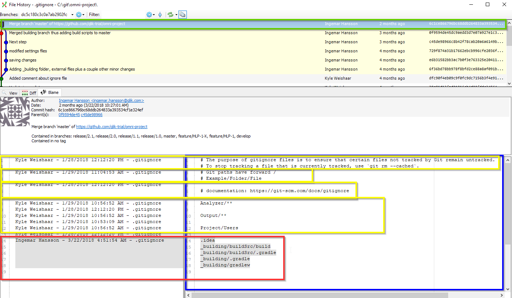
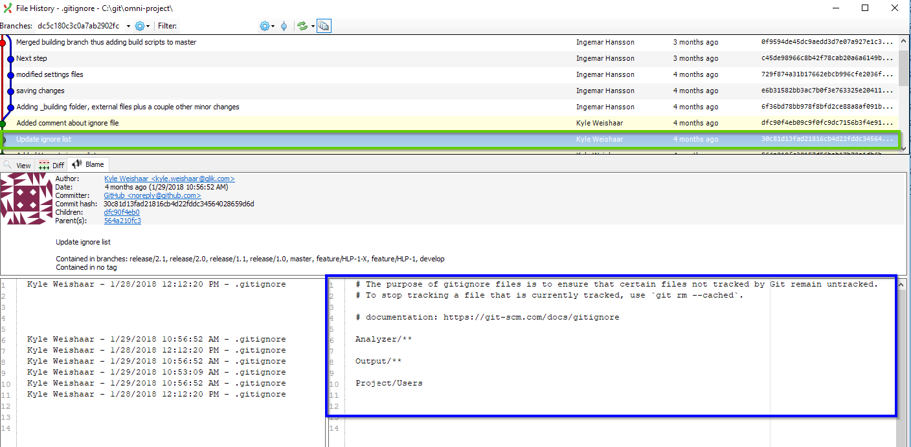

# Blame with Git Extension

Git Blame is a command that shows what revision and author last modified each line of a file.

For this example, I'll use a repo called `omni-project`.

## Git Blame

In most cases, you want to know who was the person who made a specific change. Git blame lets you look at a file associated with a commit, and to see the last author to change each line in that file.

From the main window graph:

1. Select a commit.

1. Select the **File tree** tab.

1. Right-click the file you want to blame.

1. Select **Blame**.

    A dialog opens.

    

    I selected the `.gitignore` file, which is file that git uses to filter certain files and file types.

    This window contains a lot of information:

    * Green: The current commit, the author of the commit, the date of the commit, and SHA1.

    * Blue: What the file looks like at this commit.

    * Red: The change to the file made by the current author, at this commit.

    * Yellow: The previous changes, line-by-line, by author and date.

### Drill-down

Let's say I want to know more information about when Output/** was added to the file.

1. Double-click on the line 10.

    The dialog will now show the commit associated with the change from line 10.

    