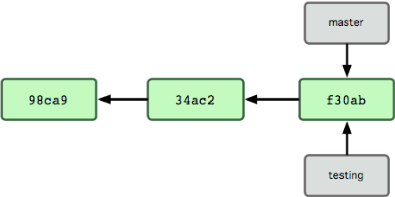
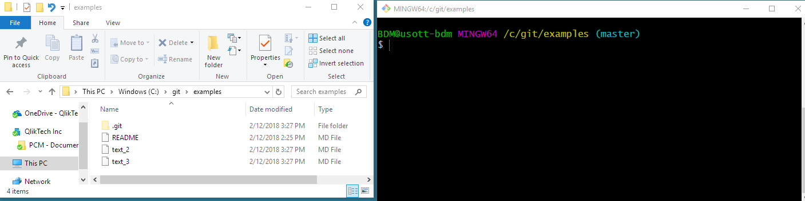
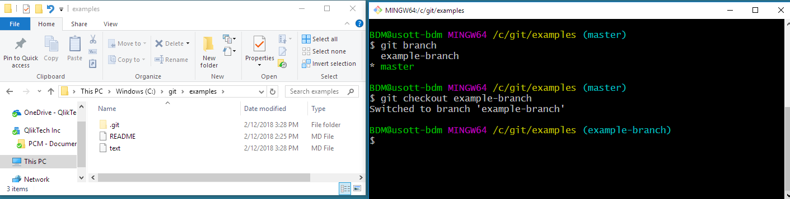

# Branches

## What is a branch

Here is a really good article to read if you want to understand the underlying reference model of git:
[What is a branch](https://git-scm.com/book/en/v1/Git-Branching-What-a-Branch-Is).

Essentially, a branch just points to a snapshot of our data (Flare documentation). So, when we create a branch, what are we doing?

## What is branching

When you create a new branch, you are copying the state of another branch. Git does this by writing a new file that references the same SHA1 that it was copied from.



When I create a branch called `testing` from `master`, `testing` and `master` are two branches that point to the exact same commit (since nothing has changed). This is how git gets away with not storing multiple copies of identical files (c.f. mapping different branches in TFS to your local machine).

The advantage of branches in git is that you can copy the state of data to an isolated working area. You can then make changes to the data without disrupting the original source. You can share this branch with others, and you can make as many commits to this branch as you want. Branching is cheap, and it's a practical way to collaborate on our documentation.

## Working directory

One major difference between git and TFS is that git does not care about the files in your working directory. Git looks at the commit that your current branch points to and creates a working directory based on that commit.

The image below shows a personal git repo named `examples`. The command shell to the right shows that I am currently on the `master` branch of this repo. My working directory currently has three files: a README file, and two text `md` files (ignore the .git folder).



A while ago, I created another branch (a copy of master) and I started doing work on this branch. Importantly, and a major difference from TFS, I don't need to open a new directory. My current working directory always reflects the branch that I am on and the files reflect the state of the branch.

I run `git branch` to see my branches.

```bash
git branch
* master
  example-branch
```

I run `git checkout example-branch` to switch to the other branch.

```bash
$ git checkout example-branch
Switched to branch 'example-branch'
Your branch is up to date with 'origin/example-branch'.
```

When I switch branches, Git rebuilds the working directory based on this branch. Now my working directory has the same README file and a different `md` file. This means that my current branch does not have all of the files (and changes to files) that are on `master`, and vice versa.



## Storage

Git doesn't store multiple copies of identical files. For example, the `examples` repo has 4 files: README, text, text\_1, and text\_2. And, your machine has the same 4 files. When you switch branches, git looks at the commit that the branch points to and builds a working directory based on that information. The versioned files are stored as blobs in the `.git` folder, but we don't want to do any work in there.
