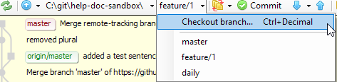

# Create a Branch with Git Extension

Let's create a new branch!

There are several ways to create a new branch. Choose whichever is most convenient for you.

-  By right-clicking a commit on which to create a new branch.

    1. Select the commit (usually the latest commit on the checked out branch)

    1. Select **Create new branch**.

    1. Name your branch `feature/HLP-XXX` or `feature/PS-XXX1` where XXX is the correct JIRA number.

    1. Select the **Checkout after create** box.

    1. Select **Create branch**.

- By selecting **Checkout new branch** from the branch drop-down menu.

    1. Select **Checkout branch**.

        

    1. Name your branch `feature/HLP-XXX` or `feature/PS-XXX1` where XXX is the correct JIRA number.

    1. Select **Checkout**.

## Keep track of branches

The benefit of a GUI like Git Extension is that we can visually keep track of branches, commits, and merges. We also have a clear view of the messages attached to commits. So let's look at the Git Extension UI in more detail as we work with branches.

Checkout the topic on the [Git Extension Graph](gitExt-graph.md).
