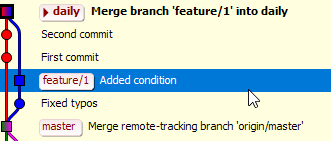
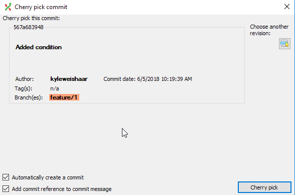
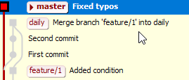

# Cherry Pick with Git Extension

Cherry pick lets you select a commit from one branch and commit it to another.

You might want to do this when you want to incorporate some small changes but not all of the changes of a branch.

## Cherry pick

I want to cherry pick one commit from `feature/hlp-1` and commit it to `master`. Let's say that I want the first commit with the message "Added condition".

1. Checkout the branch you want to commit to (`master`)

1. Right-click the commit that you want to cherry pick.

    A dialog opens.

    

    Leave both check boxes selected.

1. Click **Cherry pick**.

    The graph should now look like this:

    

### Result

The commit that we cherry picked is now on the `master` branch, and it appears at the top of the graph.

Notice that this does not result in a merge. The commit is just added to the tip of the branch as if the work was actually done on the `master` branch.