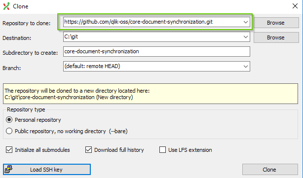

# Clone the repo

Cloning a repository means to copy the actual content of the repository and its history to your local computer.
The local copy of the repository is exact same as the repository on Github.

You can clone the repository using the command line or Git Extensions.

## Using Git Extensions

Do the following:

!!! Note
    The first time you clone a repository, **clone a github repository** appears in the opening dialog.

1. Go to **Start** > **Clone repository**.
1. Enter the repository URL. You find the URL on the Github repository page.

    It will be `https://github.com/<name-of-org>/<name-of-repo>.git`

    The subdirectory will be created automatically based on the name of the repository.

    The destination path should be `c\git`.

    **Example**

    

1. Click **Clone** when you are ready!

1. Click **OK** to open the repository.

    You should now see the git repository open in Git Extensions.

### What happened

When you clone a git repository, you take a copy of the entire repository and save it locally.
The local copy is linked to the remote copy on Github.

### Why did we do this

In a nutshell, this setup lets you work anywhere, even offline, and share your changes with other writers.
You work on your content locally, commit your changes to your local copy of the repository,
and then push your local repository changes to the remote repository.

## Using Git Bash

!!! Tip
    Need some help getting started with Git Bash?

    [Tips for using Git Bash](commandline-tips.md)

Do the following:

1. Create a new directory called `git` on your machine directly under the C directory.
    ```bash
    C:\git
    ```

1. Open Git Bash.

1. Go to the `git` directory you just created.

    ```bash
    cd ../../c/git
    ```

    ??? Info
        When you first open Git Bash you are in the Home directory, so you probably need to move up two directories
        to the C directory.

1. Clone the omni project.

    Make sure you are in the correct folder before you run the `git clone` command.

    ```bash
    cd c/git/
    git clone https://github.com/qlik-trial/help-documentation.git
    ```

    The omni-project is now cloned to your local machine.

1. Run the following command from Git Bash:

    ```bash
    cd help-documentation
    ```

    Your current directory is the help-documentation git repository.

    You should see (master) at the end of your directory path in Git Bash. Like this:

    ```bash
    BDM@usott-bdm MINGW64 /c/git/help-documentation (master)
    ```

1. Check the status of the repo (just for fun, and it's always good to know the status).

    ```bash
    git status
    ```

You now have a local copy of the repository that is being tracked by the remote `GitHub` repository.