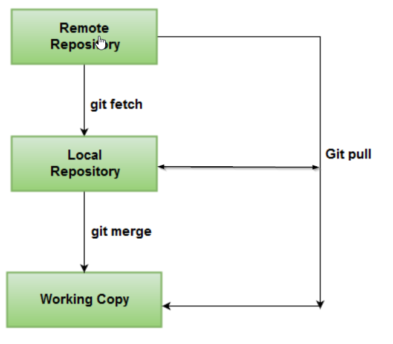
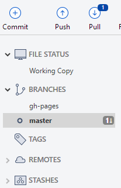
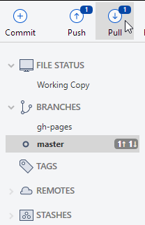
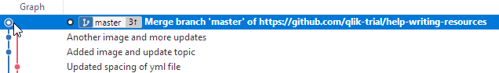
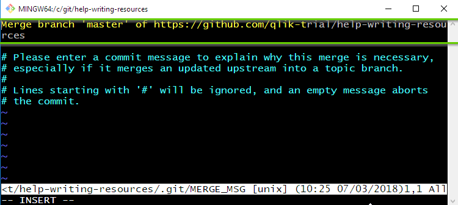

# Fetch vs. Pull

When you run `git pull`, git takes the changes from the remote that you don't have locally and tries to merge those changes to the local branch that you are working in. If you don’t closely manage your branches, you may run into frequent conflicts.

When you run `git fetch`, git gathers any commits from the remote branch that do not exist in your current branch and stores them in your local repository. However, it does not merge them with your current branch. This is particularly useful if you need to keep your repository up to date, but are working on something that might break if you update your files. To integrate the commits into your master branch, you use `merge`.

## Visual aids

1. `fetch` is a simple process.
1. `pull` is a complex process (`fetch` + `merge`).

    

### Example

!!! Note
    The screenshots below reflect the Sourcetree GUI, but the idea is much the same when using Git Extensions.

Let's say there are changes on the remote `master` branch.

1. Click **Fetch** from the ribbon.

    Notice that the pull button is marked with a number. This indicates how many commits were fetched from the remote that are now in your local repository, but are not yet merged with your current branch.

    

1. Click **Pull** from the ribbon to merge the fetched changes.

    You can continue to commit changes to your local branch. Now the push button is marked with a number that indicates how many commits from the local branch are not pushed to the remote.

    

    You cannot push your changes to the remote before you pull.

After you pull the changes, the graph will show a merge commit and an auto-generated message.



### Git Bash

With Git Bash, we rely less on visual cues and more on running the appropriate commands.

Let's say there are changes on the remote `master` branch.

```bash
git status
On branch master
Your branch is up to date with 'origin/master'.

nothing to commit, working tree clean
```

I haven't fetched anything yet, so the local branch looks to be up-to-date with `master`.

```bash
git fetch
remote: Counting objects: 3, done.
remote: Compressing objects: 100% (3/3), done.
remote: Total 3 (delta 2), reused 0 (delta 0), pack-reused 0
Unpacking objects: 100% (3/3), done.
From https://github.com/qlik-trial/help-writing-resources
   ff55aec..543a71c  master     -> origin/master
```

When I run `git fetch`, I can see that some objects were fetched from the remote.

```bash
git status
On branch master
Your branch is behind 'origin/master' by 1 commit, and can be fast-forwarded.
  (use "git pull" to update your local branch)

nothing to commit, working tree clean
```

Now when I run `git status`, git tells me that I am behind by 1 commit. So, git fetch took the changes from the remote and placed them in my local repository, but it did not merge them with my local branch.

I can continue to commit locally, using `git add` and `git commit`.

```bash
git status
On branch master
Your branch and 'origin/master' have diverged,
and have 1 and 1 different commits each, respectively.
  (use "git pull" to merge the remote branch into yours)

nothing to commit, working tree clean
```

Git is telling me that I have 1 commit to pull, and 1 commit to push (just like Sourcetree but without the visual cues).

I need to pull before I push.

!!! Recommendation
    The shell is telling you to run `git pull`. Remember though, pull is two operations: `fetch` and `merge`. Since you purposely used `git fetch`, you should probably use `git merge`. This will merge the commits from your fetch, but it wont pull any new changes from remote. For the sake of consistency, I'll use `git pull` to finish the example.

When I run `git pull`, git puts me into interactive mode.

Remember in the Sourcetree example above, Sourcetree creates an automatic commit message. Git Bash creates the message but does not save it.

Your shell will look like this (the commit message is boxed in green):



#### To save this message

1. Enter `esc`.
1. Then, type `:x` to save and exit interactive mode.

#### To change this message

1. Enter `i` (stands for insert).
1. Your cursor will open beside the message. You can delete or add the message.
1. Then type `esc`.
1. Then, type `:x` to save and exit interactive mode.

!!! Note
    If you don't have any local commits when you run `git pull`, you will not enter interactive mode since git is able to do a fast-forward merge.
    ```bash
    git pull
    Fast-forward
    mkdocs.yml | 2 +-
    1 file changed, 1 insertion(+), 1 deletion(-)
    ```

## Key take away

Use `git fetch` often to continuously update your local repository with changes from the remote. User `git merge` to merge those changes.