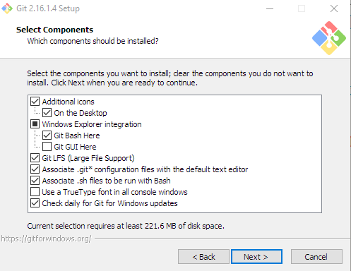

# Install Git

The first thing you should download is git. Git is a small version control program that we use to store our help documentation.

!!! Tip
    If you plan to install Git Extension, you can install Git with the Git Extensions installer.

## Git

You can download Git from the [Git Download](https://git-scm.com/download/win) site.

The installer includes:

- Git
- Git bash (CLI for Git)

!!! Reminder
    You may have missed it on the home page, but you need to request access to the private Qlik repos. See the [For new writers section](./index.md#for-new-writers).

### Components to include during setup

!!! Recommendation
    We recommend that you use Git Extension, but you can include Git Desktop in the git setup if you select **Git GUI Here**.