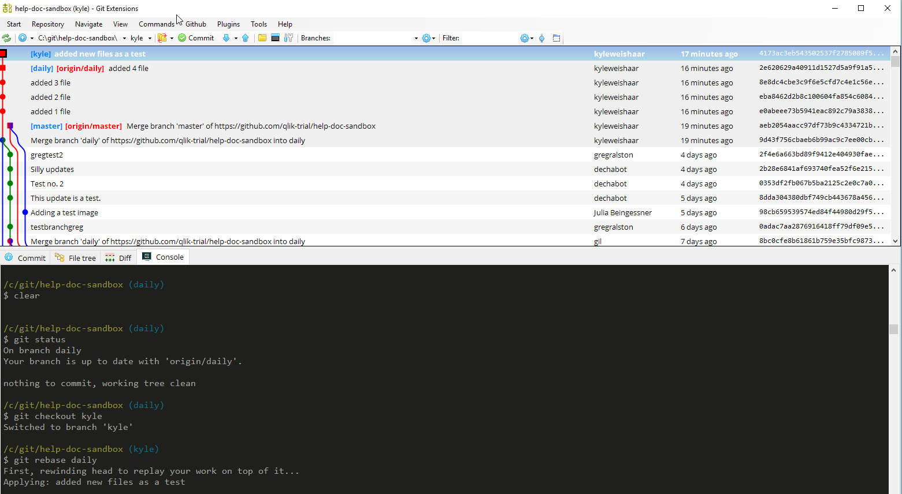
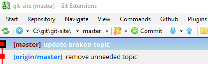
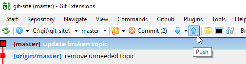
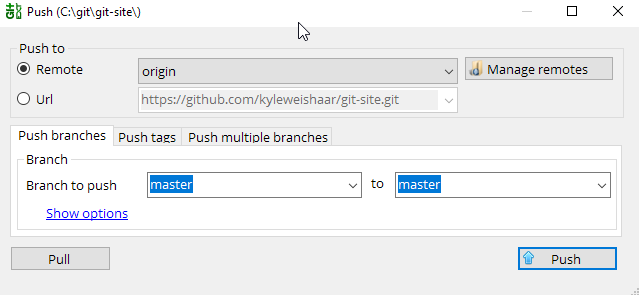

# The Git Extension Graph

When you open Git Extension, it looks something like this:

When you first clone our documentation project (or any git repo), the first thing you'll notice a graph. This graph shows your commit history. Branches are indicated with labels that point to a commit. Each dot along the line is a previous commit with a commit message.

You can locate branches:

1. In the graph as labels beside commits.

1. In the branches drop-down menu in the second task bar.

You can toggle which branches show up in the graph under **View**.

## Checking commits

The commit history is important because it shows you what file(s) changed and what changed in the document.

You can click on a commit to bring up the commit details. There are 4 tabs:

|Tab | What you'll find under this tab |
|---|---|
|Commit| Info about the commit, author, dates, SHA1, etc.|
|File tree | A navigable file tree of the current repo.|
|Diff | The differences added to the selected file in this commit.|
|Console | A console to use command line.|

## Committing your work

When you work on a file locally, git detects that the files in your working directory have changed, and it tracks those changes.

??? Info
    Git detects file changes when you click **save**, for example, in Flare or in your text editor.

In the second menu bar, you will see an **Commit** button, sometimes it has a number beside it in parentheses. This number means that git has detected some file changes that you have not yet committed to the branch.

When you work on files, they are added the working area and are currently unstaged. Before you add them to the repository, you need add them to the index by staging them.

In Git Extension, this looks like this:

Files in the red area are modified and in the working area. Files in the green area are modified and added to the index.

The actions that you'll need to do from this screen:

* Stage a file using the down arrow.

* Unstage a file using the up arrow.

* Add a commit message in the message area.

* Commit the files in the index to the repository.

* Commit and push files to the local and remote repositories.

After you commit files to the repository, you can close this dialog. You'll see a new commit at the top of the graph with your commit message.

## Committing locally but not pushing to remote

From the main window, you can toggle your remote branches under **View**. In the screen capture below, I have toggled them on so that they appear in the graph.

You'll notice that sometimes the remote branch and the local branch are pointing to different commits -- they are out of sync. This means that I need to `push` changes to the remote branch so that they are back in sync.

To push changes:

1. Use the blue arrow to push changes to the remotes.

    

1. The default behavior is to push the checked-out branch. You can also select the **Push multiple branches** tab to select more than one branch.

    

Note that:

* Only push shared branches.

* All remotes are selected by default.

* Force rewind is the inverse of fast-forward merge, but it happens on the remote rather   than the local branch.

## Changes upstream

What happens when someone else is working on the same branch as you, and they push their changes to `origin/master` while you have local changes committed but not pushed?

When the remote and local branches diverge, the remote takes precedence in that we can't push changes to a remote if the history of the two branches is different. Git forces you to either `fetch` or `pull` the changes from the remote before you `push`.

If you try to push first, Git Extension will throw an error telling you to pull first.

You just need to do a `pull` first. Select **Pull with last action**.

Git Extension will now do a `git pull` followed by `git push`. You will see the pull commit and the push commit on your graph.

!!!Tip
    You should get in the habit of running `git pull` often and especially before you push to the remote.