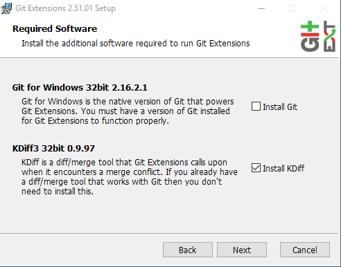

# Git Extensions Installation

Git Extensions is a powerful open-source git GUI and toolkit. If you want to avoid using the command-line,
we definitely recommend that you install Git Extensions.

Installing Git Extensions is a quick and simple process.

## Prerequisites

* You should have installed git in the previous topic. However, if you haven't already installed git,
    you can do it from the Git Extensions installer.

## Installing Git Extension

1. Grab the latest release of Git Extensions [here](https://github.com/gitextensions/gitextensions/releases).

    At time of writing, the latest release is v2.51.02.
    Scroll to the bottom of the page. You should see a download button with the version number.

1. Run the installer.

1. Select to install Git (if needed) and KDiff (merge conflict tool).

    

1. Accept the default install location.

1. In the custom setup dialog, select which features you want to install.

    Select the SSH Client.

    Select PuTTY for integration with Windows.

1. Select **Install**.

    Windows User Account Control will halt your installation. Watch for the blinking icon in your taskbar
    which indicates Windows is asking for you to confirm the installation.

    !!! Tip
        KDiff installer does not automatically pop up. If your installation looks to be hanging,
        check your taskbar for the KDiff installer.

    !!! Note
        The first time you open Git Extension, the app will verify that your machine is set up correctly.
        Click **OK** to open the app.