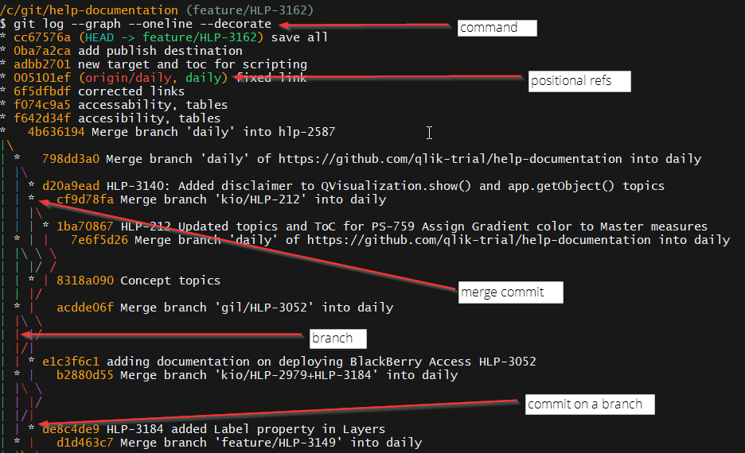

# Git History

Use Git Bash to explore your git history.

## The git graph

The git graph is the ASCII version of a git GUI, like Git Extensions.

Here are some important commands:

|command|argument|description|
|---    |---        |---|
|`git log`|--|Prints out the commit history in a list.|
||`--graph`|Prints an ASCII graph|
||`--decorate`|Shows the positional references: HEAD, branch|
||`--oneline`|Formats log to single line|



## Show a commit

Use Git Bash to explore the contents of a commit.

Here are some important commands:

|command|argument|description|
|---    |---        |---|
|`git show <something>`|--|Prints out info about a commit|
||`<sha1>`|Show the commit referenced by the SHA1|
||`<branch>`|Shows the commit that the branch is pointing to|
||`HEAD`|Shows the commit that the HEAD is pointing to|

In the image in the previous section, `HEAD` and `feature/HLP-3162` and `cc67576a` all point to the same commit.

The following commands print the same results to the terminal:

```bash
git show HEAD
#OR
git show `feature/HLP-3162`
#OR
git show `cc67576a`

commit cc67576a7142c77d3969666cf277ecdf741c8273 (HEAD -> feature/HLP-3162)
Author: kyleweishaar <kyle.weishaar@qlik.com>
Date:   Tue Jul 3 11:59:56 2018 -0400

    save all

diff --git a/Project/Targets/Sense_Hub/dev_share_scripting.fltar b/Project/Targets/Sense_Hub/dev_share_scripting.fltar
index 39644002..423cb586 100644
--- a/Project/Targets/Sense_Hub/dev_share_scripting.fltar
+++ b/Project/Targets/Sense_Hub/dev_share_scripting.fltar
@@ -5,10 +5,16 @@
   Type="CleanXHTML"
   Destinations=""
   GlossaryTermConversion="marked"
-  MasterToc="/Project/TOCs/Sense_Hub/ScriptingModule.fltoc">
+  MasterToc="/Project/TOCs/Sense_Hub/ScriptingModule.fltoc"
+  OutputFolder="C:\git\content-share">
   <PrintedOutput
     CollapseMargins="true"
     GenerateTOCProxy="true"
     GenerateIndexProxy="true"
     GenerateGlossaryProxy="true" />
+  <Destinations>
+    <Destination
+      Link="/Project/Destinations/git_hub.fldes"
+      Publish="true" />
+  </Destinations>
 </CatapultTarget>
\ No newline at end of file
```

Above, you can see the modified files and their changes that are associated with this commit.

How can we target a commit that is not the `HEAD` or a commit that is not pointed to by a branch?

You can use the sha1 number, but this can be annoying to find and copy.

You can also specify the distance from the `HEAD`. Say I want to target commit B, C or G.

```ASCII
HEAD||feature/HLP-3162      A cc67576a
                            |
                            B cd64321a
                            |
                            C ed69576a
                           /|
                          / D kl67876a
                0q60006a G  |
                            E ll63576a
```

* Target B = `git show HEAD~1` OR `git show HEAD^`

    Go to HEAD, and then go down 1 commit.

* Target C = `git show HEAD~2` OR `git show HEAD^^`

    Go to HEAD, and then go down 2 commits.

* Target G = `git show HEAD~2^2`

    Go to HEAD, and then go down 2 commits, and then pick the second parent of that commit.

## Find the source of each line

Blame is a git command that shows you the line-by-line additions to a file.

Here are some important commands:

|command|argument|description|
|---    |---        |---|
|`git blame <something>`|--|Prints out info about a commit|
||`<path/to/file>`|Shows the file line-by-line.|

```bash
/c/git/git-site (master)
$ git blame mkdocs.yml

...

^bc3dcf1 (kyleweishaar 2018-06-19 14:39:49 -0400 17) markdown_extensions:
^bc3dcf1 (kyleweishaar 2018-06-19 14:39:49 -0400 18)   - admonition
^bc3dcf1 (kyleweishaar 2018-06-19 14:39:49 -0400 21)   - pymdownx.superfences
699f4be6 (kyleweishaar 2018-06-19 15:26:03 -0400 22)   - toc:
699f4be6 (kyleweishaar 2018-06-19 15:26:03 -0400 23)       permalink: true

...

^bc3dcf1 (kyleweishaar 2018-06-19 14:39:49 -0400 26)   - Moving to Git: index.md

...

cdfac27b (kyleweishaar 2018-07-06 09:03:20 -0400 31)     - Install Meld: meld.md
^bc3dcf1 (kyleweishaar 2018-06-19 14:39:49 -0400 32)   - Learn the Basics:

```

In the terminal, I can see the lines enumerated on the right, the `SHA1` on the left, and in between, the author of the change the modification.

The `^` beside the `SHA1` indicates that the line was added at the first first. `SHA1` numbers without the `^` means they were added later.

### Comparing commits

Use `git diff` to compare two commits.

Here are some important commands:

|command|argument|description|
|---    |---        |---|
|`git diff HEAD HEAD~2`|--|Prints out the diff between the current commit and the commit 2 commits below the HEAD.|
|`git diff <branch> <branch1>`|--|Prints out the diff between tips of two branches.|

#### Example

Want to know if you need to rebase?

The following command returned all of the commits that are on daily but not on my bug/hlp-3288 branch.

```/c/git/help-documentation (bug/hlp-3288)
$ git log bug/hlp-3288..daily --oneline
32463c3c (origin/daily, daily) Merge branch 'cleanup2/Dan' into daily
a741f376 Fix another capitalization issue plus change "which" to "that"
7c33c9a5 Merge branch 'cleanup2/Dan' into daily
8699c385 Fix "id" capitalization issues
08ddae9a Merge branch 'kio/feature/HLP-3113' into daily
2aae7670 Added FT and edited documents for updcoming Insight Advisor features
39ec0c36 Merge branch 'improvement/hlp-2792' into daily
d1091761 Merge branch 'epic/HLP-2326' into daily
8fcb8ada Updated resource filter topic
7f901344 added Ruggero's comments and prepared for tech+peer review
2999a89a Merge branch 'improvement/hlp-2792' into daily
14897a4d Fixed links (?)
f2e38ea0 Merge branch 'hlp-3316' into daily
c602b467 accessibility, links tables and images
725638e5 Merge branch 'improvement/hlp-2792' into daily
0631b375 Fixed broken links in certificates topics.
57378fbb Merge branch 'QABDI_rnt' into daily
c2f16ee8 Adding SSH to deployment
baf94433 Merge branch 'cleanup2/Dan' into daily
166d5956 Delete unused <ul> tag
59f86cc0 Clean up capitalization and incomplete steps
824b7199 Merge branch 'improvement/hlp-2792' into daily
571d0ae3 HLP-2792 (certificates)
6be876ef Merge branch 'hlp-2587' into daily
```

If I rebased daily onto my bug branch then these are the commits that I will get.

## More on `git log`

Here are some important commands:

|command|argument|description|
|---    |---        |---|
|`git log`|--|Prints out the commit history in a list.|
||`--patch`|Prints a detailed diff for each commit in the log.|
||`--grep <string>`|Filters the log to show only commits that contain the string|
||`-n`|Shows the log for _n_ commits back.|
