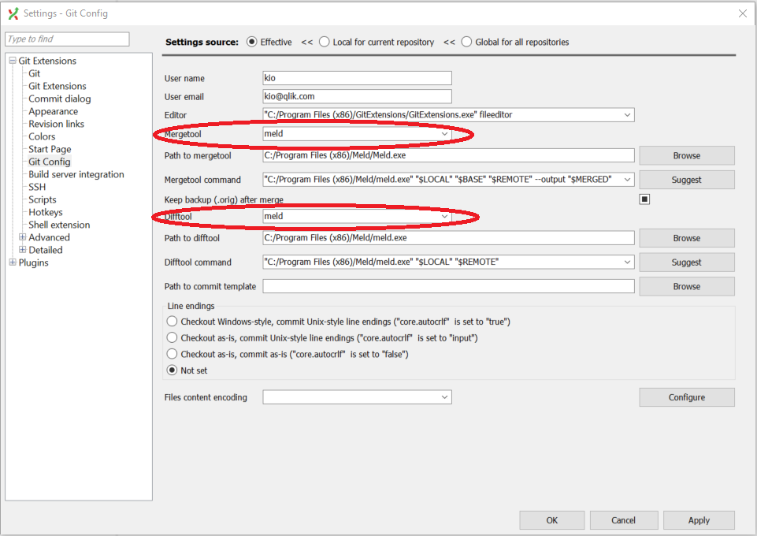

# Meld

!!! Reminder
    Meld is an optional download. You are not required to use Meld.

Meld is a visual diff and merge tool. Although Git Extension has default integration with KDiff, you can change the default diff and merge tool to Meld, which is visually more simple than KDiff.

## Installing Meld

1. Download the latest version of Meld [here](http://meldmerge.org/).

1. Run the installer.

1. In Git Extensions, select **Tools** > **Settings**.

1. Under **Git Config** > **Mergetool**, select `meld` from the drop-down menu.

1. Under **Git Config** > **Difftool**, select `meld` from the drop-down menu.

    The configuration should look like this:

    

1. Click **Apply**.

1. Click **Ok**.