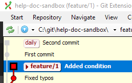
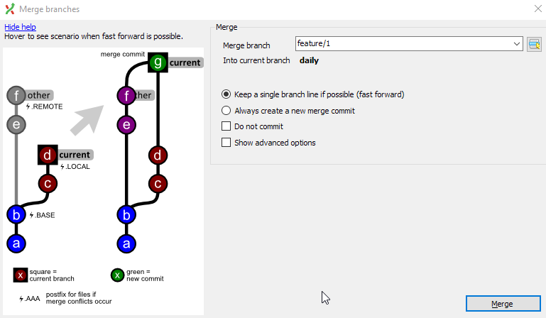
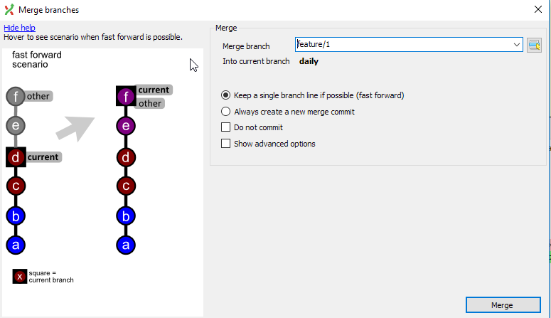
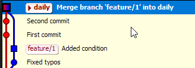

# Merge with Git Extension

After you have finished with a feature or a task, you'll want to merge your feature branch into daily so you can build the output. You need to do a  `git merge`.

Say we have the following structure, `feature/HLP-1` and `daily`.

```ascii
     A--B--C feature/HLP-1
    /
D--E--F--G daily
```

Let's assume we are on `daily`.

* `feature/HLP-1` points to commit C, which has a history of B, A, and E.

    E is the commit where `feature/HLP-1` diverged.

* `daily` points to commit G, which has a history of F through D.

Our goal is to merge `feature/HLP-1` into `daily`, resulting in:

```ascii
     A--B--C feature/HLP-1
    /       \
D--E--F--G---H daily
```

`daily` now points to a new commit H that has both commit H and commit C as its parents.

## Merge

I'll use my omni sandbox repo to show a merge with Git Extension.

I created a `feature/hlp-1` and did some work on this branch. I also did some work on `daily`. `daily` points to the commit with the message "second commit" and `feature/HLP-1` points to a commit with the message "Added condition" Both branches have commits that the other branch does not have.



Git Extensions also shows me that I am on `feature/HLP-1` (square commit).

I want to take the latest commit from `feature/HLP-1` and merge that into `daily`.

1. Checkout `daily`.

1. Rihgt-click the latest commit on `feature/HLP-1`.

1. Select **merge into current branch** > `feature/HLP-1`

    A dialog opens that looks like this:

    

    This dialog shows you the graphical representation of what will happen to your branches after a merge commit. Also, since the **Keep single branch line if possible** is selected, when you hover over the image you'll see this:

    

    This is showing you a fast-forward merge if this is possible. In our current example, this is not possible since our branch histories differ.

1. Select **Merge**.

    The graph now looks like this:

    

## Delete after finished

Make sure you are not checkout on the branch that you want to delete.

1. Right-click the commit beside the branch label in the graph.

1. Select **Delete branch** > `feature/HLP-1`

    A dialog opens. You can select **Force delete** if you have some uncommitted changes on this branch that have not been merged (and that you don't want to keep).

1. Click **Delete**.

!!! Note
    You only want to delete feature branches after the work is finished that the commits have been squashed and cherry-picked to master.
