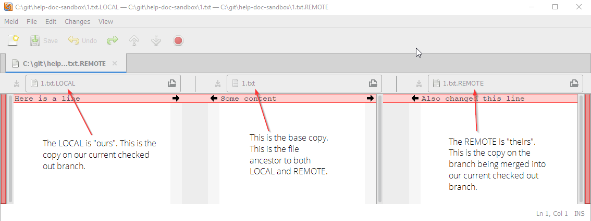
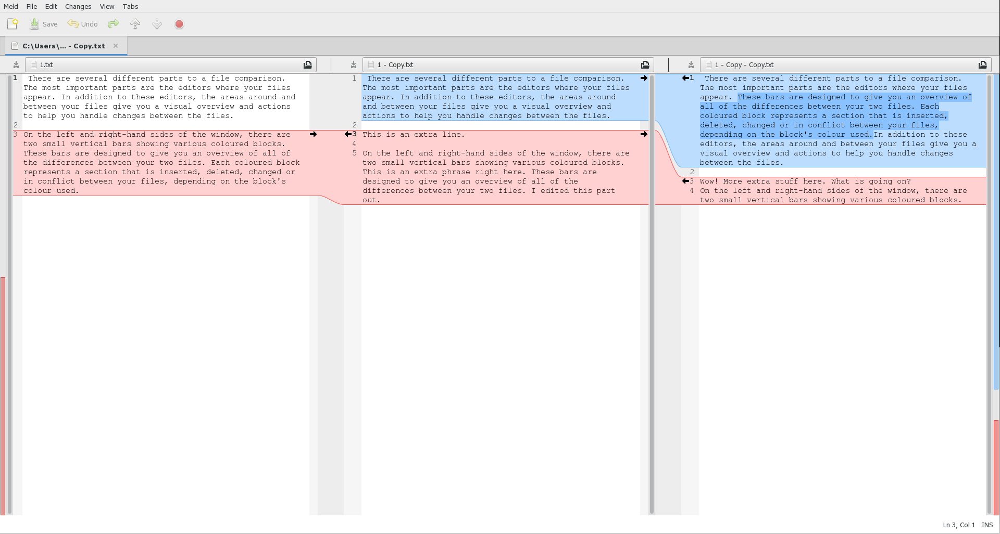
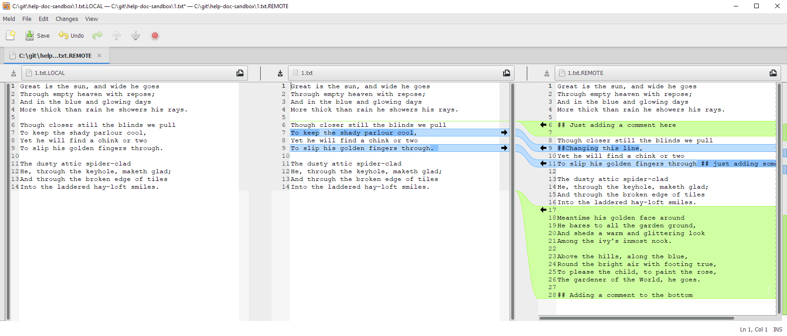
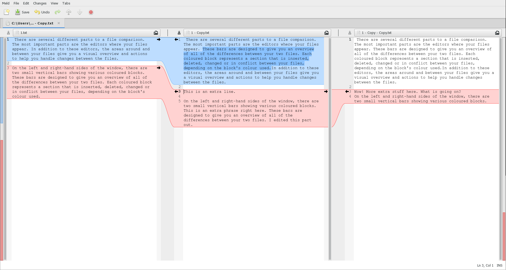

# Merge tools

When a conflict occurs, Git Extensions suggests that you solve the conflict. Git Extension opens conflicts in whichever tool you configure as your default merge and diff tool. In this example, we look at Meld, but other tools work similarily.

## Overview of the mergetool

### Mine, theirs, and ancestor

### Understanding colors

|Color | Indicates|
|---    |---    |
|Red|Lines in conflict|
|Blue|Lines with resolved conflicts|
|Green|Added lines|

### Solving the conflict

The goal of the merge tool is to create the correct file in the middle window. You can replace, add, or delete lines using the arrows, or you can edit the content directly in the window.

#### Replace

Click an arrow beside colored content to _push_ it in that direction.

It will replace the content in the adjacent window. This is the default functionality. (In the example below, I clicked on the first arrow on the file located on the right, replacing the content in the file in the middle).

#### Add

To add content, hold down `Ctrl` to turn the arrows into `+` signs.

Click on the `+` sign to add content to the adjacent window.

#### Delete

To delete content, hold down `Shift` to turn the arrows into `x` signs.

Click on the `x` to delete the content in the adjacent file.

Learn more [here](http://meldmerge.org/help/file-mode.html).
