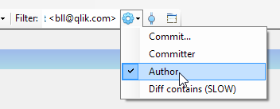
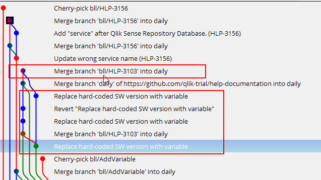
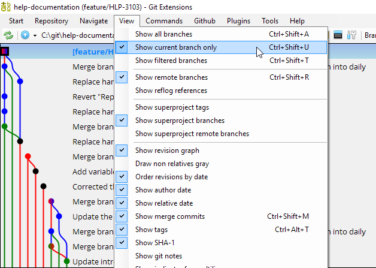
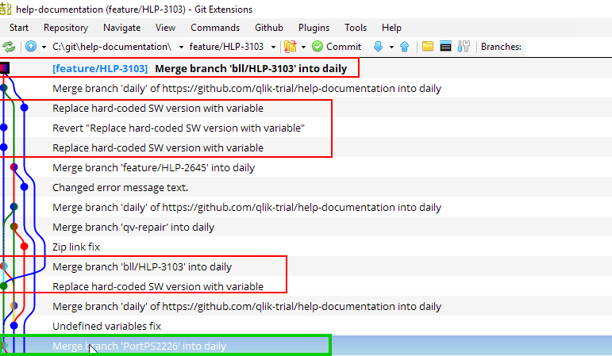
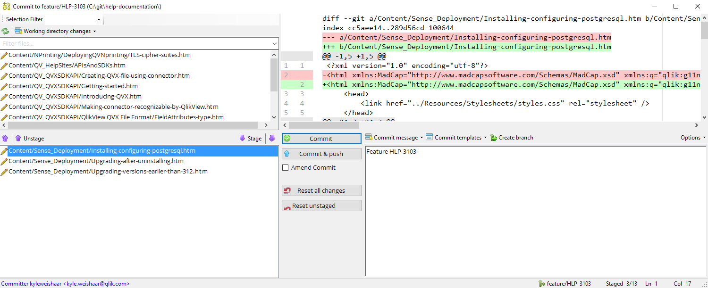
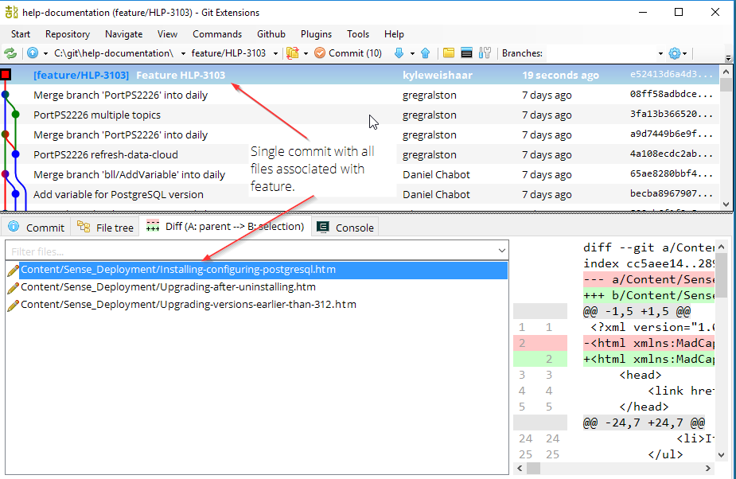
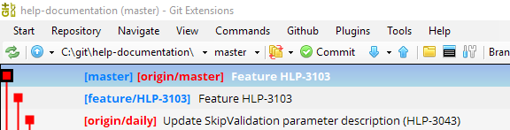

# Recover a deleted branch

If you forget to cherry-pick your feature to `master`, and you delete your branch, then you'll need to locate the commits on the `daily` branch.

## Filter

The easiest way to find your commits is to use the filter option in Git Extension.



1. Select **Author**.

1. Enter your name exactly as it appears in the commit information (name + email).

    `First Last <trigram@qlik.com>`

    For example:

    ```ASCII
    Author: First Last <trigram@qlik.com>
    Date: 19 hours ago (7/4/2018 4:08:57 PM)
    Commit hash: 3d79a92d56a9742d7dcc2963c554000894e401d4
    ```

After you add the filter, you only see your own commits.



The branch I want to recover is `feature/HLP-3103`. I can see which files were changed in each commit by clicking on a commit and looking at the **Commit** (shows the files) and **Diff** (shows the changes) tabs.

The commits highlighted in red are the commits that I am interested in.

## Create branch

I want to create a branch at the latest relevant commit that was merged into `daily`.

1. Right-click the commit.

1. Select **Create new branch**.

1. Name the branch with the correct feature name (example):

    `feature/HLP-3103`

1. Select **View** > **Show current branch only**.

    

!!! Note
    Now the graph is showing your recovered branch and only your commits.

!!! Note
    Remember that a branch is just a reference to a commit. Once I located the last merge commit into `daily`, I can create a new branch based on that commit. Recovering a commit means adding a reference file to the HEAD of the deleted branch.

## Reset files

1. Clear the author filter.

1. Find the parent of the first commit you did on this feature branch.

    In the image below, in red are the commits associated with the feature. In green is the parent of the earliest commit on my feature branch. How do I know it is the parent? Locate the earliest commit and trace that branch down.

    

    ```ASCII
    *   Replace hard-coded SW version with variable (earliest commit)
    |
    |
    *   Merge branch 'PortPS2226' into daily (parent)
    ```

1. Right-click the parent commit.

1. Select **Reset current branch to here**.

1. Leave the **Mixed** option.

The commit button will indicate that you have some files to commit. Click on the commit button to open the dialog. You will see some files in the working area. You will have a clean index (because you selected the mixed reset).

You might see files not part of your feature. This is because other people have committed to `daily`, and these commits are parents of other commits in the new branch.



1. Select the files associated with the feature and stage them.

    They should be in the index.

1. Write a commit message: feature name.

1. Select **Commit**.

    

    At the top of the branch we now have a single commit associated with the feature.

    !!!Tip
        You still have to reset the files in the working area. Open the commit window and click
        **Rest all changes**.

## Cherry-pick to `master`

1. Select **View** > **Show all branches**.

1. Checkout `master`.

1. Pull `master`.

1. Right-click the commit on your feature branch.

1. Select **Cherry-pick**.

1. Resolve conflicts if there are any.

## The result



Verify the content before deleting the local branch.