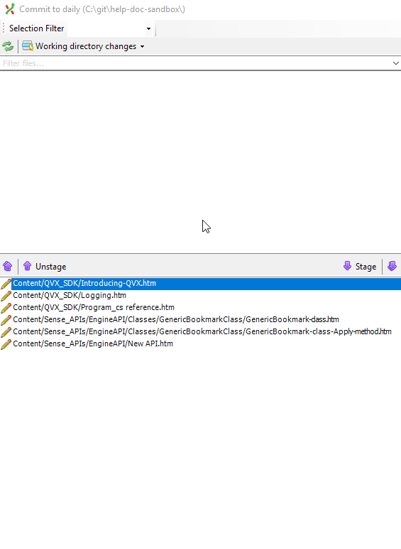
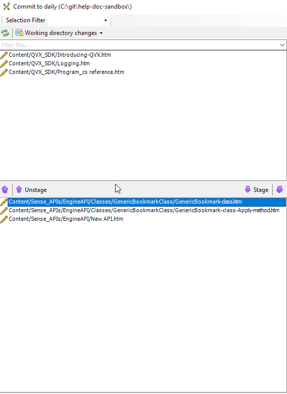
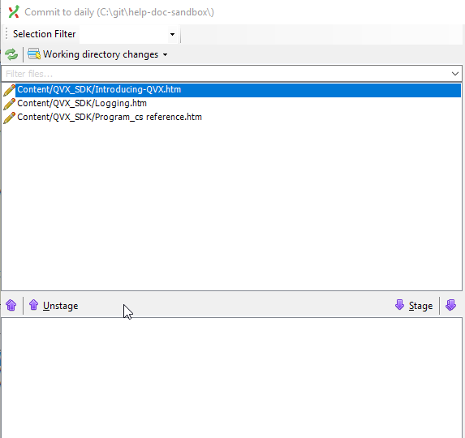

# Reverse a Commit with Git Extension

Mistakes happen, so it's good to know that we can reverse our commit in a safe way.

Reversing a commit is the preferred way to undo the changes associated with a commit because it does not delete the commit. Instead, it creates a new commit in which it reverses the changes that occurred in the commit,thus saving your commit history.

## Difference between Git Reset and Git Revert

### Git Revert

* Safe process
* Keeps commit history
* Reverse the commit by creating a new commit

```ascii
A--B--C
git revert (reverse C by committing D)
A--B--C--D
```

### Git Reset

* Destructive process
* Costly mistakes
* History is lost

```ascii
A--B--C
git reset (delete C)
A--B
```

## Example

To reverse a commit, do the following:

1. Right-click the commit that you want to revert.
1. Select **Revert commit**.
1. Click **Revert this commit**.

    If you leave the **Automatically create a new commit** box unselected, the files associated with this commit will be staged but not committed. You will have to commit them manually. This might be useful if a commit contains many files, and you only want to revert _some_ of the files.

For example, after reverting a commit but not automatically merging, I can see 6 files in the index.



I only want to revert changes associated with the Engine API.

1. Unstage the files that you don't want to revert.

    

1. Add a commit message of add to the auto-generated message.

1. Select **Commit**.

    The unstaged files are still modified in the working area.

    

1. Highlight the unstaged files.

1. Right-click the highlighted files.

1. Select **Reset file or directory changes**.

Now your working area is back to normal and you have reverted the selected files from the commit.