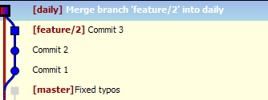

# Squash Commits with Git Extension

Squashing commits does exactly what it says! It takes two or more commits and squashes them into a single commit.

This is useful when you want to push your changes to a public branch as a single commit that represents a work task or feature. Specifically, this is what we need to do when we finish a feature and merge that work with `master`.

When you are working locally, and committing early and often, small frequent commits are helpful for you, but it is probably less helpful for the team. Squashing keeps a simple commit history.

## Squash your commits

I created a `feature/2` branch and I have made three commits on this branch. I have already merged my feature branch into `daily` and checked the output. My feature is complete. Now I want to squash my feature branch.

My Git Extension graph looks like this right now:

To squash your commits if Git Extension, we use `git reset --soft`.

1. First, make sure you check out your feature branch.

1. Right-click the parent commit of the commits that you want to squash. In most cases, this is the commit that your branch was created from.

    In the image above, the commit I want to pick is the one _before_ "Commit 1" (the parent of that commit).

1. Select **Reset current branch to here**.

    A dialog opens.

    Select **Soft: leave working directory and index untouched**.

1. Select OK.

    When you come back to your graph, it will look a bit messy, but that is because the action rest the files from the feature branch commits. Notice the commit menu has a number beside it now.

1. Click on the commit menu.

1. Add a commit message and select commit. Make sure you are not pushing these changes.

    Your commit message should be "Squashing feature HLP-X"

1. Now you will see a single commit on your feature branch at the top of the graph.

    

Now this commit can be cherry-picked anywhere it needs to go.

See [Cherry-pick with Git Extension](cherrypick-gitExt.md).