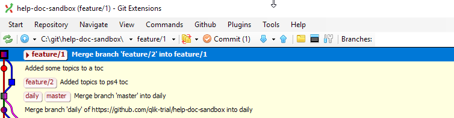
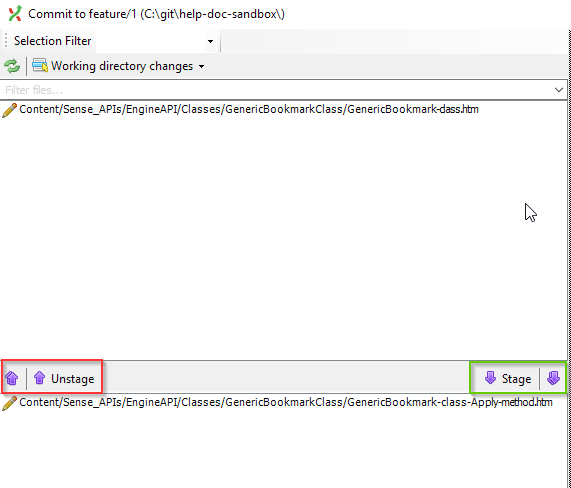
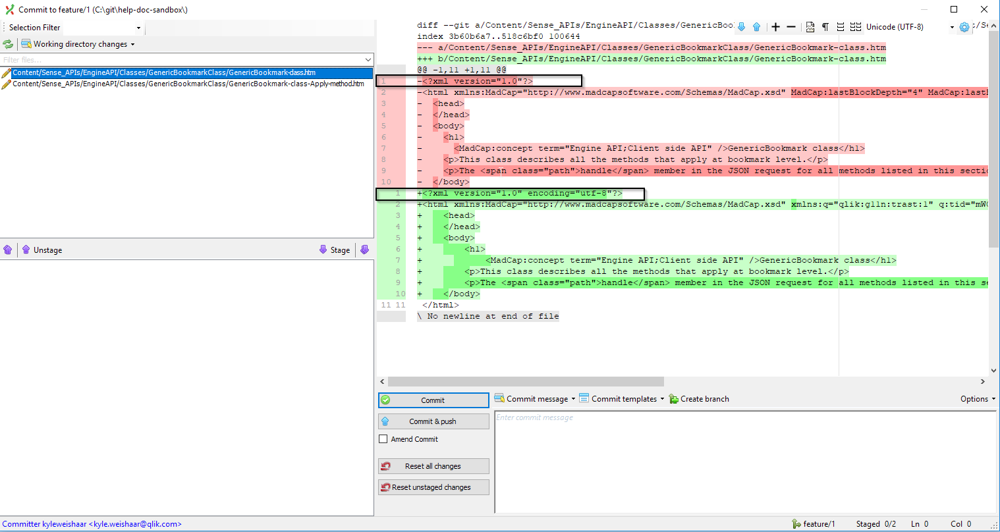
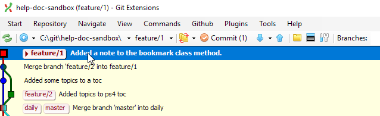
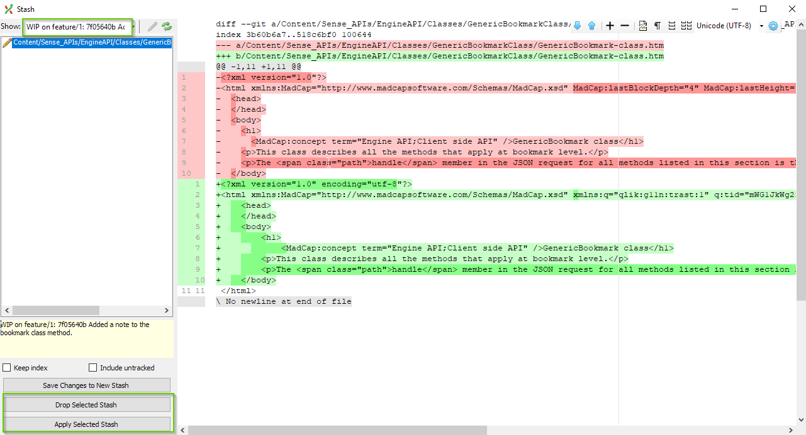
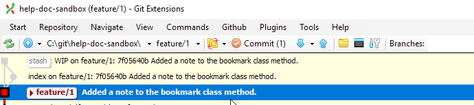
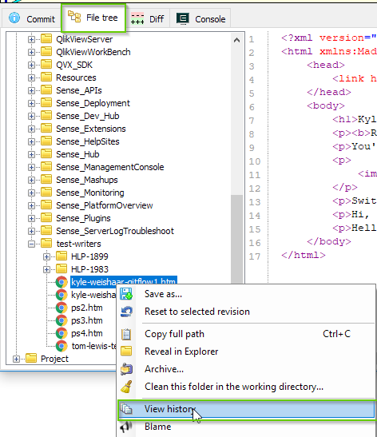
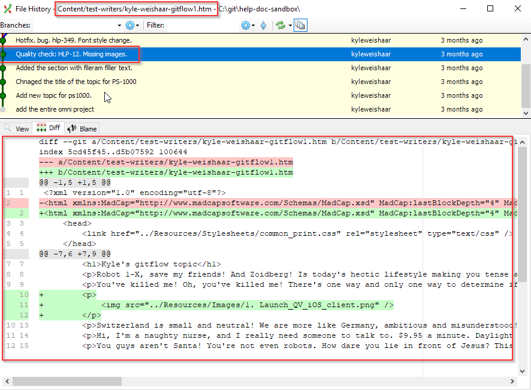

# Working on a file in Git Extension

The majority of our work involves creating and editing individual files. Git Extension helps us do most of this work.

## See the changes to a file

When you start to edit a file in a git repo, git keeps tracks of the changes.

Look at the image below. The second menu bar at the top indicates that we have _Commit (1)_, telling us that we have one uncommitted change.

## Stage the file and/or changes

Files in git are in one of three states:

* _unstaged_ (they are modified and in the working area)
* _staged_ (they are staged and in the index)
* _committed_ (they have been added to the repository)

Git Extension lets you stage the entire file, or you can select pieces of a file to stage as _hunks_.

Why would you want to stage a file in hunks?

* You might want to append a commit message to a subset of the changes.
* You may want to commit small pieces so you can reverse-commit small changes (if needed).
* If it works for your workflow, then do it!

### Stage

1. To stage changes, click the **Commit (X)** button in the Git Extension task bar.

    A dialog opens.

1. Select the file you want to stage. You can select multiple files by holding down CTRL while selecting files.

    Use the down arrows to stage a file or stage all, and use the up arrows to unstage a file or unstage all.

    

### Stage hunks

If you are working on a file and have many added/removed lines, you can stage hunks.

1. Right click the line you want to stage and select **Stage select line**.

1. Or, highlight a section (multiple lines) to stage more than one line.

    When you stage hunks, make sure to select the add/remove equivalent. For example, line 1 changed by adding the encoding UTF=8. Make sure to stage both the line highlighted in red and that line 1 highlighted in green.

    

## Commit file changes to a branch

After you stage individual files, hunks, or lines, you then commit those staged files to the branch. When you commit, all _staged_ files (files that are added to the index) are included in the commit.

1. Write a message in the commit message area.

1. Click **Commit**.

    Feature branches are not tracked on Github so we don't need to push changes. If you are committing directly to a shared branch then you can select **Commit & push**.

After you commit the changes to the branch, the Git Extension graph will show the newest commit at the top with the message that you added.

More on branches in the [branching](branches.md) section.

## Stash file changes for later

Git Extension helps you stash file changes so you can access them later. For example, at the end of the day, you have made a bunch of changes to a topic, but you don't want to commit these changes to a branch just yet. You can save the state of the file as a _stash_ that you can retrieve later.

Stashing moves to files out of your working area and the index, and saves them to an area called *stash*. This lets you work on other files without losing the changes you've already made, and it keeps them out of the way so you don't accidentally stage them with some other work.

To stash changes:

1. Leave the changes in your working area (the can be in the index too, but BP says to have them in your working area).

1. From the main Git Extension dialog, click **Commands** from the top task menu.

    A dialog opens.

1. If you are working on other files and they are added to the index, select the **Keep Index** box.

1. If the files are new (not yet tracked in the repository) select **Include untracked**.

1. Select **Save Changes to New Stash**.

    The stash is saved to the stash dialog window under `WIP <branch> <file>`.

Now I want to bring my stash back into the working area.

1. Click **Commands** > **Stash Changes**.

    A dialog opens.

    

1. Select the stash, then **Apply Select Stash** to apply the stash to the current branch.

    The graph will show that the index has been added and there will be a pending commit.

    

1. Commit the changes as normal.

    If you do not need to keep the stash, select the option **Drop Selected Stash**.

## Recommit previous file versions

It can be useful to be able to quickly see the state of a file at any point along the branch history and to change a file back to this state. You can do this by viewing the history of a file and revert the commit.

1. Use the **File Tree** to see the file history.

    Right-click the file and select **View History**.

    

    A dialog opens.

    

    At the top, you can see which file history you are looking at.

    Select commits in the graph to see the version of that file at that commit.

    The **Diff** tab shows you how that file looked at that commit.

1. When you find the file version you want, right-click the *commit* that has that version.

    Select **Manipulate commit** > **Revert commit**.

    !!!Warning
        Make sure **Automatically create a commit** is deselected.

1. When you go back to the main window, you'll see a number beside the commit button. The files associated with the commit you are reverting are in the index.

1. Unstage the files that you don't want to revert.

1. Leave a commit message and select **Commit**.

    A new commit is added to the top of the graph that reverts the files to the previous version.

!!! Reminder
    If there were more than one file associated with a commit, those files are added back into the working area. After you commit the file you want to revert, just discard the files in the working area.

    Right-click the files and select **Reset files or directory changes**.